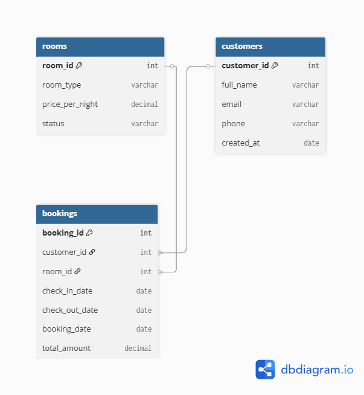
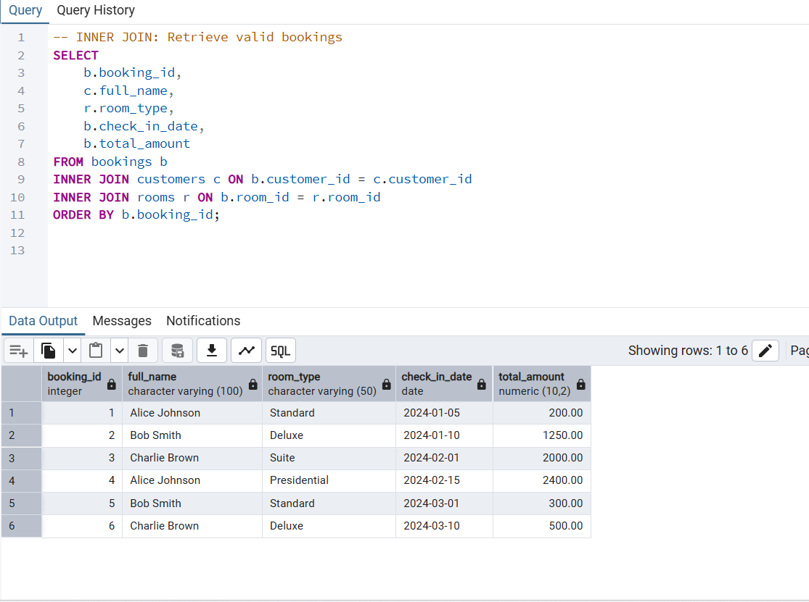
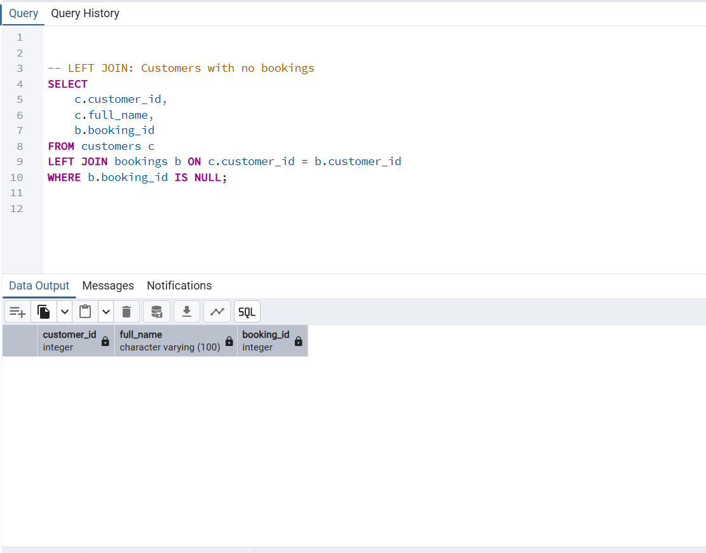
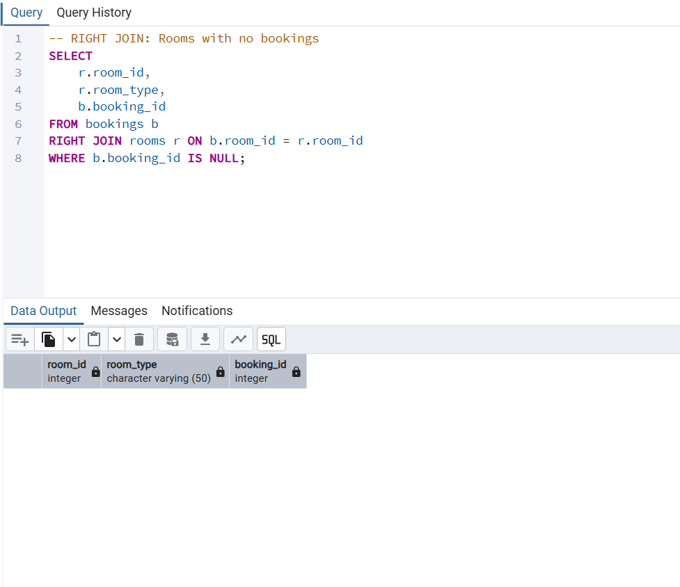
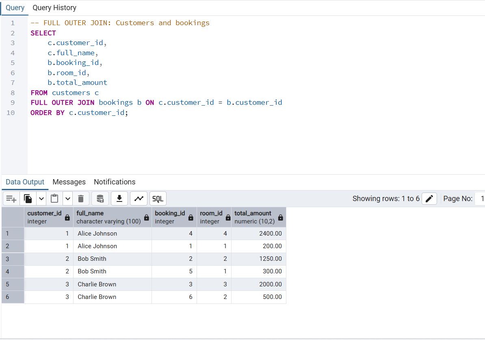
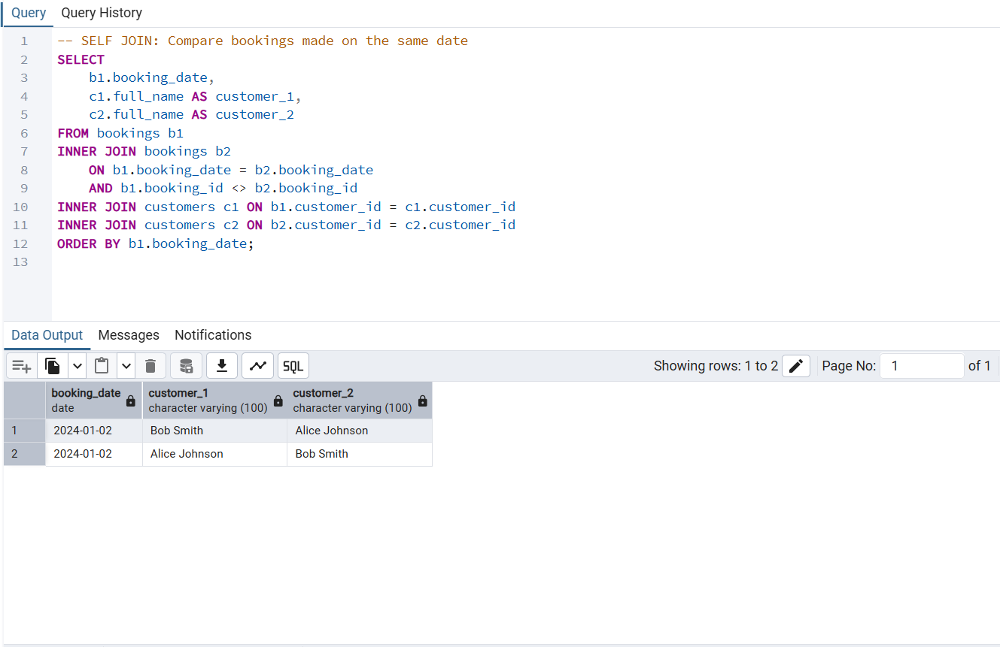
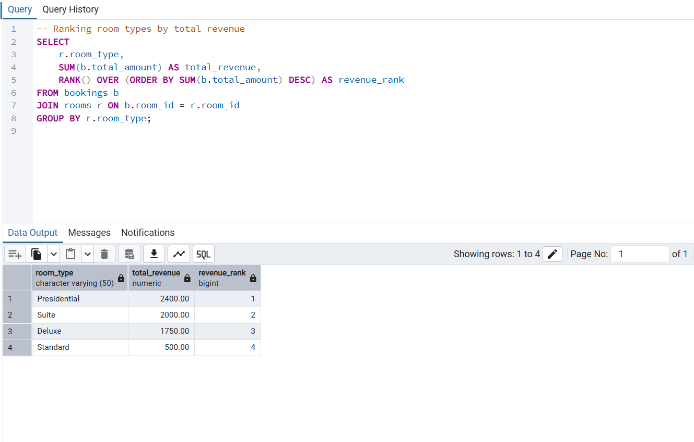
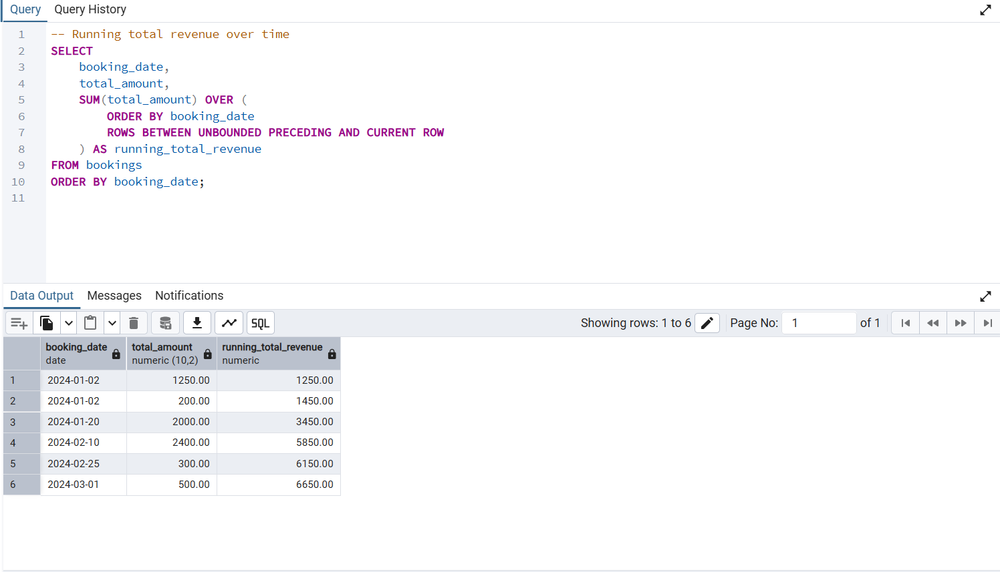
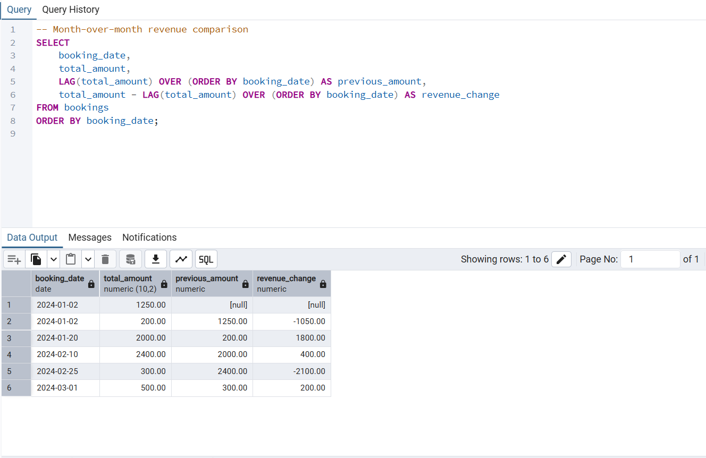
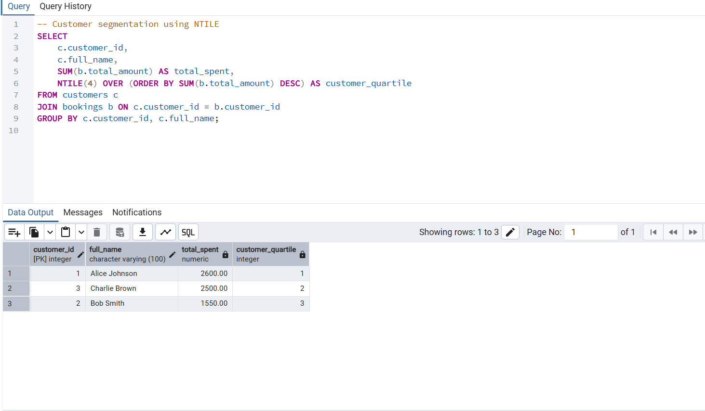

# SQL JOINs and Window Functions Project

## 1. Business Problem Definition

### Business Context

The business operates in the hospitality industry as a hotel management company. The analysis focuses on the reservations and sales department, which is responsible for managing customer bookings, room allocation, and revenue tracking across different room types.

### Data Challenge

The hotel generates a large volume of booking data across multiple room types and time periods. Management lacks clear visibility into booking trends, revenue performance over time, and customer booking behavior, making it difficult to identify top-performing rooms and periods with low occupancy.

### Expected Outcome

The analysis aims to provide insights into room performance, customer booking patterns, and revenue trends over time to support data-driven decisions on pricing strategies, promotions, and occupancy optimization.

## 2. Success Criteria
The success of this project will be measured using the following criteria:

1. Identify the top 5 room types based on total revenue per month using ranking window functions such as RANK() and DENSE_RANK().
2. Calculate running total booking revenue over time to analyze cumulative revenue trends using SUM() OVER().
3. Measure month-over-month revenue changes to identify booking growth or decline using LAG().
4. Segment customers into four quartiles based on their total booking value using NTILE(4) for customer classification.
5. Calculate a three-month moving average of booking revenue to detect seasonal trends using AVG() OVER().

## 3. Database Schema Design
### Tables Description

**customers**

- customer_id (PK): Unique identifier for each customer
- full_name: Name of the customer
- email: Customer email address
- phone: Contact number
- created_at: Date the customer was registered

**rooms**
- room_id (PK): Unique identifier for each room
- room_type: Type of room (Single, Double, Suite, etc.)
- price_per_night: Cost per night
- status: Availability status of the room

**bookings**
- booking_id (PK): Unique identifier for each booking
- customer_id (FK): References customers(customer_id)
- room_id (FK): References rooms(room_id)
- check_in_date: Check-in date
- check_out_date: Check-out date
- total_amount: Total booking cost
- booking_date: Date the booking was made

### Table Relationships

- Each customer can make multiple bookings, but each booking belongs to one customer.
- Each room can be booked multiple times over different periods, but each booking refers to one room.
- The bookings table acts as a junction table linking customers and rooms.

### Entity Relationship Diagram (ERD)
The ER diagram below illustrates the relationships between customers, rooms, and bookings.

## 4. Part A: SQL JOINs Implementation
### 4.1 INNER JOIN
This query retrieves bookings that have valid customer and room records.

**Business Interpretation:**  
The result shows only confirmed bookings linked to existing customers and rooms, helping management analyze valid revenue-generating transactions.

### 4.2 LEFT JOIN

This query identifies customers who have never made any booking.

**Business Interpretation:**  
Customers without bookings may represent inactive or newly registered users. The hotel can target these customers with marketing campaigns or special offers.

### 4.3 RIGHT JOIN

This query identifies rooms that have never been booked.

**Business Interpretation:**  
Rooms without bookings may indicate low demand or pricing issues. Management can consider promotions or pricing adjustments for these rooms.

### 4.4 FULL OUTER JOIN

This query retrieves all customers and bookings, including records that do not have matching entries.

**Business Interpretation:**  
This provides a complete overview of booking activity and customer engagement, highlighting unmatched records that require attention.

### 4.5 SELF JOIN

This query compares bookings made on the same booking date by different customers.

**Business Interpretation:**  
Multiple bookings on the same date may indicate peak demand periods. This insight helps management plan staffing and optimize pricing strategies.

## 5. Part B: SQL Window Functions Implementation
### 5.1 Ranking Functions

This query ranks room types based on total revenue generated.

**Interpretation:**  
Higher-ranked room types generate more revenue and should be prioritized in pricing and marketing strategies.

### 5.2 Aggregate Window Functions

This query calculates a running total of booking revenue over time.

**Interpretation:**  
The running total shows cumulative revenue growth and helps management track financial performance over time.

### 5.3 Navigation Functions

This query compares each booking’s revenue with the previous one.

**Interpretation:**  
Revenue changes between periods highlight growth or decline trends, supporting pricing and promotion decisions.

### 5.4 Distribution Functions

This query segments customers into quartiles based on total booking value.

**Interpretation:**  
Customer segmentation helps identify high-value customers and design targeted loyalty programs.

## 6. Results Analysis

### Descriptive Analysis
The analysis shows booking trends, revenue performance by room type, and customer spending behavior.

### Diagnostic Analysis
Revenue differences are driven by room pricing, booking frequency, and customer preferences.

### Prescriptive Analysis
The hotel should focus on promoting high-revenue room types, offer incentives to low-activity customers, and optimize pricing during peak demand periods.

## 7. References

- PostgreSQL Official Documentation
- SQL Window Functions Documentation
- Database Design Tutorials(youtube)

## 8. Integrity Statement
All sources were properly cited. Implementations and analysis represent original work. No AI-generated content was copied without attribution or adaptation.

